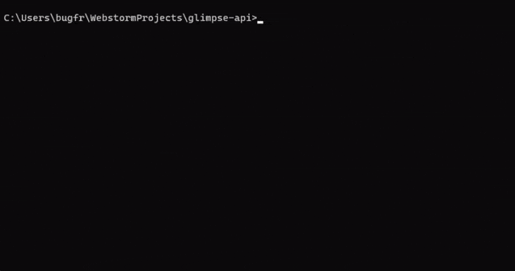

<!--suppress HtmlDeprecatedAttribute -->


# Glimpse API &middot; <!-- [](https://travis-ci.org/npm/npm) --> [](https://github.com/your/your-project/blob/master/LICENSE)

This is the backend API for Glimpse, the RPI TV website. For more information about the project, including features,
check out the [project wiki](https://github.com/rpitv/glimpse-api/wiki).

View the project in action at https://rpi.tv/.

## Installing / Getting started

It's recommended to use Docker with Docker Compose for production deployments. To use the provided Docker Compose file,
Docker Compose must be version 1.28.0 or higher.

Start by cloning this repository.

```shell
git clone https://github.com/rpitv/glimpse-api.git
cd glimpse-api
```

Then create your `.env.docker` file. You can use the `.env.sample` file as a template, and then modify it to match your
environment.

```shell
cp .env.sample .env.docker
```

After that, you can start up the Docker containers.

```shell
docker compose --profile api-production up -d
```

This will pull the latest version of this repository's Docker image and start it up with the necessary dependencies.
You can then use Prisma and the CLI to bootstrap your database. This requires the current LTS version of Node.js and 
NPM.

```shell
npx prisma migrate deploy # Create the database schema
npm run cli # Start the CLI
```



Alternatively, you can bootstrap the database manually. Read more on the 
[Bootstrapping](https://github.com/rpitv/glimpse-api/wiki/Bootstrapping) article.

When you are done, it's highly recommended to modify your `docker-compose.yml` so that only the API service has its
port(s) exposed to the host machine. For more information or alternative options for deployment, check out the 
[Deployment](https://github.com/rpitv/glimpse-api/wiki/Deployment) article.

## Developing

### Built With

This project is built on [NestJS](https://nestjs.com/) and written in [TypeScript](http://typescriptlang.org/). 
Additional major dependencies include:

- [Prisma](https://www.prisma.sh/)
- [CASL](https://casl.js.org/v6/en/)
- [Passport](https://www.passportjs.org/)

The project also depends on the following services:

- PostgreSQL
- Redis
- RabbitMQ

### Prerequisites

To run the development environment for this project, you should have Node.js LTS installed, along with NPM. We
recommend using [NVM](https://github.com/nvm-sh/nvm) to manage your Node.js installation. If you are on Windows, you 
can use [NVM for Windows](https://github.com/coreybutler/nvm-windows).

While the API does not run in Docker for development, you should have Docker and Docker Compose installed for running
the other services which the API depends on. This project has been tested on Docker Engine version 20.10. Docker Compose
must be version 1.28.0 or higher.

Git must also be installed to clone the repository and manage your changes.

### Setting up Dev

Start by cloning the repository. We recommend using SSH for this, as it is more secure, but you can use HTTPS if you 
prefer or are not able to use SSH.

```shell
git clone git@github.com:rpitv/glimpse-api.git
cd glimpse-api/
npm i
```

After that, you will need to create your `.env` file. You can use the `.env.sample` file as a template, and then modify
it to match your environment.

```shell
cp .env.sample .env
```

Once you have your `.env` file, you will need to create a `.env.docker` file. Your `.env.docker` file should be the same
as your `.env` file, except any references to `localhost` need to be replaced with their corresponding Docker service
names. For example, if you have `RABBITMQ_URL= RABBITMQ_URL=amqp://localhost:5672`, you would change it to
`RABBITMQ_URL= RABBITMQ_URL=amqp://rabbitmq:5672`.

Now you can start up the Docker containers which the API depends on.

```shell
docker compose up -d
```

Once the database is up and running, you can use Prisma and the CLI to bootstrap your database.

```shell
npx prisma migrate deploy # Create the database schema
npm run cli # Start the CLI
```


Once your database is initialized, you can start the API.

```shell
npm run start:dev
```

The API will be available at http://localhost:4000. A GraphQL playground will be available at 
http://localhost:4000/graphql.

### Building

In order to build the project, you will need to complete all of the above steps in the [Setting up Dev](#setting-up-dev)
section. The project can then be built using the build command:

```shell
npm run build
```

The built files will be in the `dist/` directory.

### Deploying / Publishing

The built project can be run using the start:prod command:

```shell
npm run start:prod
```

Alternatively, run the JavaScript file directly:

```shell
node dist/src/main
```

## Versioning

 This project is still in early beta and proper versioning has not yet been set up. However, we will likely be
implementing [SemVer](http://semver.org/) versioning at some point in the future.

## Configuration

Currently, all configuration for this project is controlled via `.env` files. You can use the `.env.sample` file as a
template, and then modify it to match your environment. `.env.docker` is used for Docker deployments, and should be
the same as your `.env` file, except any references to `localhost` need to be replaced with their corresponding Docker
service names.

### Environment Variables

| Name                    | Description                                                                                                                                                                                                                                                                                       |
|-------------------------|---------------------------------------------------------------------------------------------------------------------------------------------------------------------------------------------------------------------------------------------------------------------------------------------------|
| `NODE_ENV`              | The environment in which the API is running.                                                                                                                                                                                                                                                      |
| `DATABASE_URL`          | The URL which the API should use to connect to the database. This is also used by the `prisma` CLI for database migrations.                                                                                                                                                                       |
| `REDIS_URL`             | The URL which the API should use to connect to the Redis server.                                                                                                                                                                                                                                  |
| `RABBITMQ_URL`          | The URL which the API should use to connect to the RabbitMQ server.                                                                                                                                                                                                                               |
| `SESSION_SECRET`        | A random string used to encrypt session secrets. Recommended to be a string at least 100 characters long.                                                                                                                                                                                         |
| `DISCORD_CLIENT_ID`     | Client ID used for Discord OAuth authentication. Currently required.                                                                                                                                                                                                                              |
| `DISCORD_CLIENT_SECRET` | Discord client secret used for Discord OAuth authentication. Currently required.                                                                                                                                                                                                                  |
| `DISCORD_CALLBACK_URL`  | The URL to redirect the user to after successful Discord authentication. This should be the `/auth/discord` endpoint behind your proxy.                                                                                                                                                           |
| `TRUST_PROXY`           | Value to pass to Express's `trust proxy` configuration setting. Since this application is intended to be ran behind a proxy, you will need to supply this if you want the API to reliably be able to detect users' IP addresses. You should set it as specific as possible (probably `loopback`). |

## Tests

The test suite is currently incomplete. You can run the tests using the test command:

```shell
npm run test
```

## Style guide

This project generally follows the guidelines found here: https://github.com/elsewhencode/project-guidelines

Code style is enforced using ESLint and Prettier. When you set up your development environment, as long as you follow
the provided instructions, a Git hook will be installed which will automatically format your code pre-commit. If you'd
like to do this manually, you can pass the `--ignore-scripts` flag to `npm i` to skip the Git hook installation and
run `npm run format` before committing your code.

An `.editorconfig` file is provided to help your editor automatically format your code to match the project's style.

## API Reference

### GraphQL

The API is primarily controlled via GraphQL, which has built-in documentation. Please 
[introspect](https://graphql.org/learn/introspection/) the API to view available documentation.

### HTTP

#### GET `/auth/discord`

##### Query Parameters

All query parameters are optional.

- `redirect` - The URL to redirect to after authentication. Can be relative or absolute.
- `code` - The Discord OAuth2 code. This is automatically provided by Discord after a successful authentication.
- `state` - The state parameter for the OAuth2 request. This is automatically provided by Discord after a successful 
  authentication.
- `error` - The error parameter for the OAuth2 request. This is automatically provided by Discord after a failed 
  authentication.
- `error_description` - The error description parameter for the OAuth2 request. This is automatically provided by 
  Discord after a failed authentication.

##### Response

The response will vary depending on whether the `code` or `error` query parameters are present.

- If neither `code` nor `error` are present, the user will be redirected to Discord to authenticate. If the `redirect` 
  query parameter is present, it will be saved for when the user returns from Discord. None of the other query
  parameters have any effect in this state.
- If `code` is present, the code will be used to attempt to authenticate the user. If `state` is not present,
  authentication will always fail. Otherwise, authentication will pass if the `state` matches the saved state and
  Discord returns a valid access token. If the `redirect` query parameter was present when `state` was generated,
  the user will be redirected to the URL that was specified. Otherwise, the user will be redirected to `/`. In the 
  event of successful authentication, a `glimpse-sess` cookie will be assigned within the redirect response.
- If `error` is present, or if `code` is present but Discord returns an invalid access token, the user will be 
  redirected to `/login?error=oauth_fail`. If the `redirect` query parameter was present when `state` was 
  generated, the user will be redirected to `/login?error=oauth_fail&redirect=<redirect>`.

Note that this API is intended to be proxied in production, e.g. to `/api`. The URLs that the user can be redirected to
should be implemented elsewhere (e.g. [rpitv/glimpse-ui](https://github.com/rpitv/glimpse-ui)), and will return a 404 if
the API is not being accessed through a proxy. Currently, there is no way to adjust the redirect URLs.

## Database

This project uses PostgreSQL v14 within it's default Docker containers. If you wish to run your database outside of
Docker, no other version has been tested.

Redis v7 is also used for state and session management.

## Licensing

This project is licensed under the MIT License - see the [LICENSE](LICENSE) file for details.
